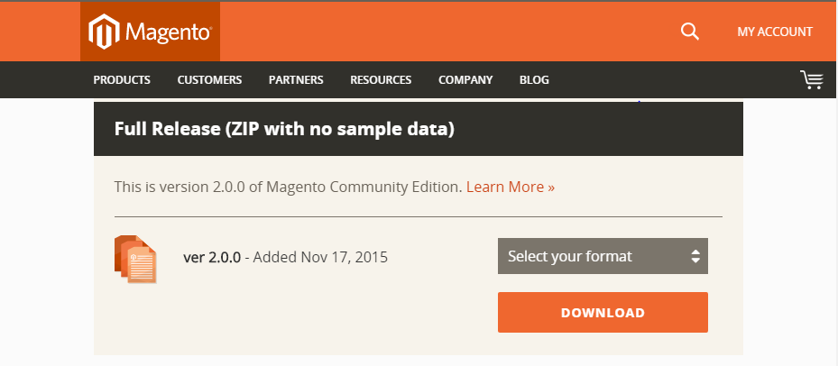
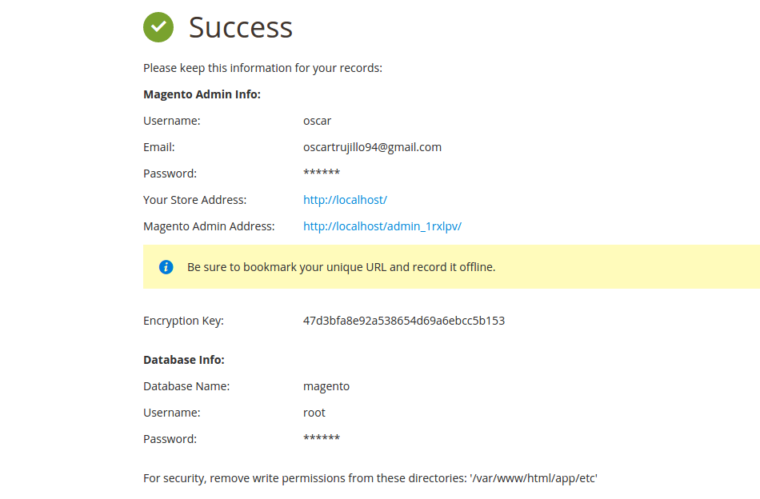

# Comercio electrónico

## Magento
### 0. Índice
1. Introducción.
2. Instalación de Magento en el equipo.
3. Instalación con la web.
4. Ejemplos de usos.
5. Problemas resueltos.

### 1. Introducción.

Magento es un gestor de contenidos web opensource para comercio electrónico. Es una solución flexible y escalable con la que se pueden desarrollar prácticamente todo tipo de proyectos e-commerce.

Ofrece muchas funcionalidades entre las que destacan especialmente la gran flexibilidad en el diseño y un panel de control.
Magento fue adquirida en 2011 por eBay.

Los pasos seguidos en este tutorial se han ejecutado en una máquina con las siguientes versiones de los servicios:

* Magento 2.0.0.
* PHP 5.5.9
* MySQL 5.6.27
* Apache2 2.4.7

### 2. Instalación de Magento.
    
El paquete de Magento está preparado para ser instalado directamente en nuestro servidor. Para instalarlo necesitamos preparar a nuestros servidor con los requisitos que la herramienta nos pide para su correcto funcionamiento.

En este tutorial se usará la version 2.0.0. Recién sacada al mercado.

##### 2.1 Prepara el entorno.
* Apache:
    : Necesitamos configurar Apache para que pueda manejar Magento correctamente. Crearemos un nuevo archivo de configuración en la ruta `/etc/apache2/sites-available/`. En nuestro caso lo llamaremos: `magento`:

            sudo nano /etc/apache2/sites-available/magento.conf
    
	: En este archivo deberemos escribir lo siguiente:
	
        	<VirtualHost *:80>
            DocumentRoot /var/www/html
            <Directory /var/www/html/>
                Options Indexes FollowSymLinks MultiViews
                AllowOverride All
            </Directory>
            </VirtualHost>
            
    : Guardamos el archivo y a continuación, primero deshabilitaremos la configuración que viene por defecto con Apache y después habilitaremos la nueva configuración que acabamos de definir:
    
            sudo a2dissite 000-default.conf
            sudo a2ensite magento.conf

*  PHP
    : Necesitamos tener PHP instalado en nuestra máquina. Además se hace necesario instalar los módulos PHP `php5-curl php5-gd php5-mcrypt`. Estas extensiones permiten a Magento manejar adecuadamente las peticiones HTTP, las imágenes en miniatura, y el cifrado de datos:

            sudo apt-get update
            sudo apt-get install libcurl3 php5-curl php5-gd php5-mcrypt
    
    : Una vez hecho esto activaremos en Apache el módulo `rewrite` y en PHP el módulo `mcrypt` que nos permite encriptar. 
    
            sudo a2enmod rewrite
            sudo php5enmod mcrypt
    : Ya estamos listos para rearrancar el servicio apache.
    
            sudo service apache2 restart

* MySQL

    :  El último servicio que configuraremos en nuestra máquina será MySQL. Lo primero es entrar a MySQL con la cuenta de root:
    
            mysql -u root -p
    : Crearemos una nueva base de datos que en nuestro caso se llamará `magento`:
    
            CREATE DATABASE magento;
    : También debemos de crear un usuario y darle privilegios sobre nuestra base de datos. Ese usuario será el que usará Magento para conectarse con la base de datos.
            
            CREATE USER magento_user@localhost IDENTIFIED BY 'password';
            GRANT ALL PRIVILEGES ON magento.* TO magento_user@localhost IDENTIFIED BY 'password';
    : Para a asegurarnos de que nuestros cambios se actualizan en la base de datos recargaremos los privilegios manualmente y ya podremos salir de la base de datos:
    
            FLUSH PRIVILEGES;
            exit
            
            
##### 2.1 Descarga Magento.

Para descargar magento recomiento hacerlo desde la [página web oficial](https://www.magentocommerce.com/download "página web oficial"). Para el tutorial he usado concretamente la versión "Full Release (ZIP with no sample data)". Una vez descargado el paquéte procederemos a descomprimirlo y a moverlo a la dirección `/var/www/html/` donde previamente hemos configurado Apache:

        tar xzvf magento-2.0.0.tar.gz
        sudo rsync -avP ~/magento/. /var/www/html/
        rm -rf ~/magento*
Ahora es fundamental cambiar al propietario de dicho archivo para que apache sea capaz de majarlo:

        sudo chown -R www-data:www-data /var/www/html/

### 3. Instalación con la web.

Ya tenemos nuestro entorno preparado para recibir a Magento y tenemos a Magento descargado en nuestra máquina. Ahora debemos de instalarlo y la forma de hacerlo es realmente cómoda, tan solo debemos de ingresar en nuestro navegador la dirección de nuestro servidor, en nuestro caso localhost:

            http://localhost/
Durante la instalación tan solo deberemos de configurar los parámetros vistos anteriormente de la base de datos para que se pueda conectar con ella. Tambien deberemos crearnos una cuenta de administrador y elegir idioma y país de origen.

![][1]
##### Paso 1:
![][2]
##### Paso 2:
![][3]
##### Paso 3:
![][4]
##### Paso 4:
![][5]
##### Paso 5:
![][6]
##### Paso 6:
![][7]

[1]: images/c3.png
[2]: images/c1.png
[3]: images/c2.png
[4]: images/c4.png
[5]: images/c5.png
[6]: images/c6.png
[7]: images/c8.png

##### Listo!
Una vez configurado esto tendremos lista nuestra plataforma!

### 4. Ejemplos de uso.

### 5. Problemas resueltos.
* ¿Problemas para atentificarte como admin?
    : Aconsejo no usar chrome como navegador al trabajar con Magento si lo hemos instalado en nuestro localhost. resulta que da problemas de autenticación debido a que detecta localhost como insegura y corta las peticiones que manda Magento.
